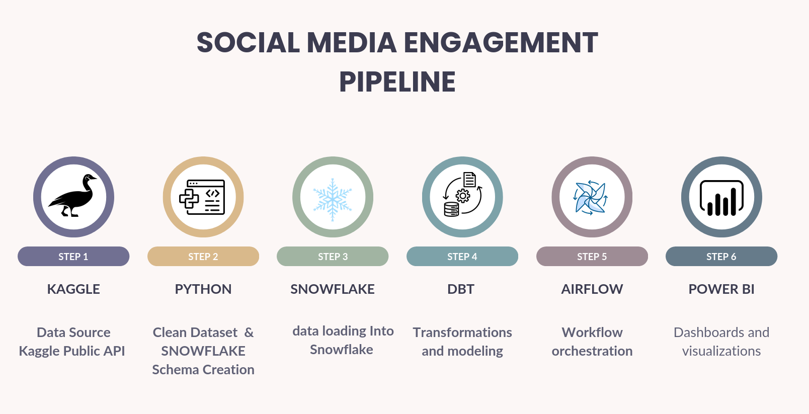
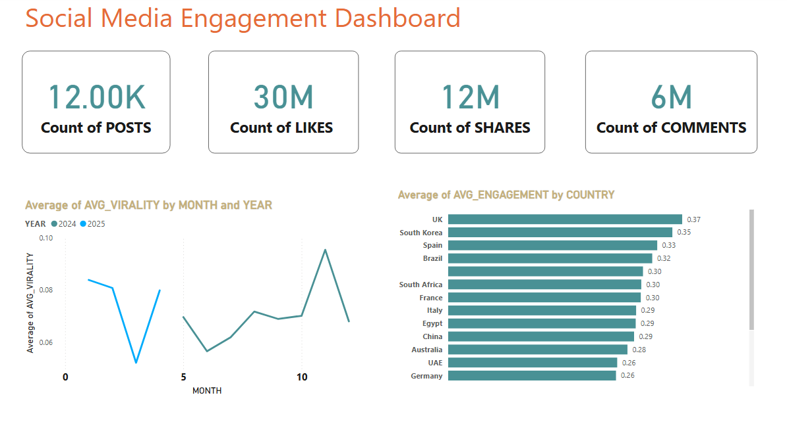
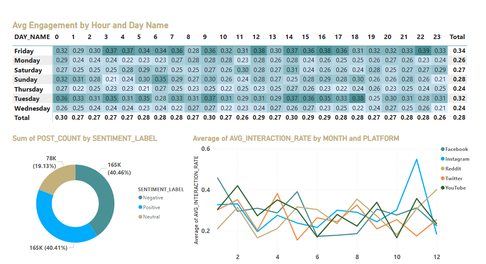

# 📊 Social Media Engagement Data Pipeline

This project builds a complete data pipeline to process, transform, and visualize social media engagement data using modern data tools.

---

## 🚀 Pipeline Overview

| Step | Tool      | Description                                 | Icon |
|------|-----------|---------------------------------------------|------|
| ✅ **Step 1** | **Kaggle**   | Public dataset used as source via Kaggle API | 🐦 |
| ✅ **Step 2** | **Python**   | created Snowflake schema                     | 🐍 |
| ✅ **Step 3** | **Snowflake**| Loaded raw data into Snowflake tables        | ❄️ |
| ✅ **Step 4** | **dbt**      | Data transformation, staging, marts, and analysis models | 🧱 |
| ✅ **Step 5** | **Airflow**  | Scheduled dbt runs using DAGs                | 🌬️ |
| ✅ **Step 6** | **Power BI** | Built dashboards and insights                | 📊 |

### 🧬 Visual Diagram



---

## 📥 Data Source

- **Kaggle Dataset**: Downloaded using the [Kaggle Public API](https://www.kaggle.com/docs/api)

---

## 🏗️ Tech Stack

- **Python**: schema creation
- **Snowflake**: Data warehousing
- **dbt**: Data transformation and modeling
- **Apache Airflow**: Workflow orchestration
- **Power BI**: Dashboarding and reporting

---

## 🔐 Snowflake Connection (`profiles.yml`)

To connect `dbt` to Snowflake, create the `profiles.yml` file in the path:

```bash
~/.dbt/profiles.yml

your_profile_name:
  target: dev
  outputs:
    dev:
      type: snowflake
      account: <your_account>.snowflakecomputing.com
      user: <your_username>
      password: <your_password>
      role: <your_role>
      database: <your_database>
      warehouse: <your_warehouse>
      schema: <your_schema>
      threads: 4
      client_session_keep_alive: true

---

## 🧠 How to Run

```bash
# Setup Python env and install dependencies
python -m venv venv
source venv/bin/activate
pip install dbt-core dbt-snowflake    # install dbt core and dbt for snowflake 

# Run dbt transformations
cd DBT_snowflake_data
dbt run
dbt test     # to run the test
dbt docs generate     # dbt automatic generate for documentation
dbt docs serve --port 8088  # to view the documenation  

# Run Airflow for orchestration
pip install apache-airflow              
pip install apache-airflow-providers-snowflake 
export AIRFLOW_HOME=~/airflow           
mkdir -p ~/airflow/dags
nano ~/airflow/dags/dbt_dag.py       
airflow db migrate          
airflow standalone          #instead of airflow scheduler& airflow api-server

---   
## 📈 Visual Analysis

Power BI dashboards were created using marts and staging data from the dbt models. Below are some of the key visualizations:

- 📊 **Heatmap of Hourly Engagement by Day**  
- 💬 **Post Sentiment Breakdown (Positive / Neutral / Negative)**  
- 🌍 **Average Interaction Rate by Platform Over Time**  
- 🌐 **Geographical Engagement by Country**  
- 🔁 **Virality Trend by Month and Year**
- 🔢 **KPI Tiles for Total Posts, Likes, Shares, and Comments**

---

## 📊 Dashboards

### 📌 Dashboard Page 1: Campaign, Sentiment, and Time Insights



### 📌 Dashboard Page 2: Global Metrics and Virality Trends



